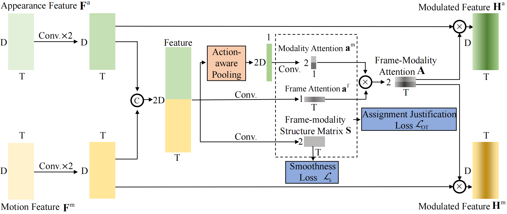

# Structured Attention Composition for Temporal Action Localization

This repository is the official implementation of SAC. In this work, we tackle the temporal action localization task from the perspective of modality, and precisely assign frame-modality attention. Paper from [arXiv]().




## Requirements

To install requirements:

```setup
conda env create -n env_name -f environment.yaml
```

Before running the code, please activate this conda environment.
## Data Preparation

a. Download pre-extracted features from [baiduyun](https://pan.baidu.com/s/1DMoawh2dI_ntp-IB1EVkCg) (code:6666)

~~~~
Please ensure the data structure is as below

├── data
   └── thumos
       └── val
           ├── video_validation_0000051_02432.npz
           ├── video_validation_0000051_02560.npz
           ├── ...
       └── test
           ├── video_test_0000004_00000.npz
           ├── video_test_0000004_00256.npz
           ├── ...
~~~~

## Train 

a. Config

Adjust configurations.

`./experiments/thumos/network.yaml`

c. Train

```train
cd tools
bash run.sh
```
## Inference

a. You can download pre-trained models from [baiduyun](https://pan.baidu.com/s/1zf3SxhNyDwK_4E2xP1v7qg) (code:6666), and put the weight file in the folder `checkpoint`.

- Performance

|| 0.1   | 0.2   | 0.3   | 0.4   | 0.5   | 0.6  | 0.7   |0.8  | 0.9   | Average |
|:-:|:-:|:-:|:-:|:-:|:-:|:-:|:-:|:-:|:-:|:-:|
|mAP|75.54 | 73.65|  69.09 | 61.06 | 51.44 | 37.10 | 22.75 | 8.63  | 1.43 | 44.52 |


b. Test

```eval
cd tools
python eval.py
```


## Related Projects
- [BackTAL](https://github.com/VividLe/BackTAL): Background-Click Supervision for Temporal Action Localization.
- [A2Net](https://github.com/VividLe/A2Net): Revisiting Anchor Mechanisms for Temporal Action Localization.

## Contact
For any discussions, please contact [nwpuyangle@gmail.com](mailto:nwpuyangle@gmail.com).
